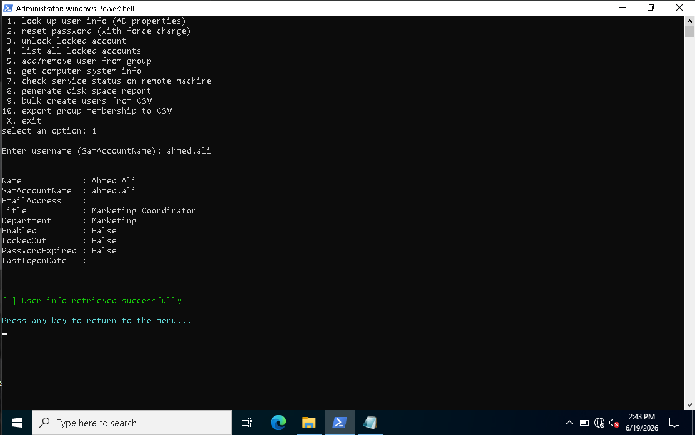
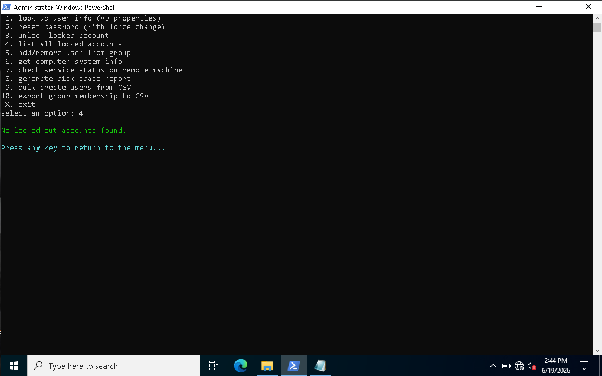
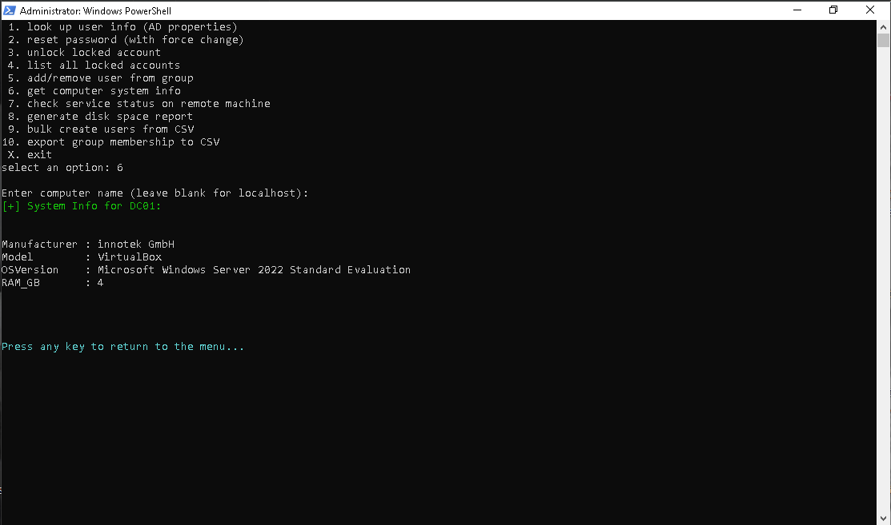

# Powershell Helpdesk Toolkit
created a new menu PowerShell script that applies 10 features of AD

1. **Look up user info**: Fetches AD properties and formats them cleanly into a list.
2. **Reset password**: Resets a user's password securely and forces a change at the next logon.
3. **Unlock locked accounts**: Unlocks an individual AD account.
4. **List all locked accounts**: Scans the domain for locked-out accounts and formats the list into an auto-sized table.
5. **Add/remove user from groups**: Prompts for add/remove actions and updates AD group membership.
6. **Get computer system info**: Uses `Get-CimInstance` to look up RAM, OS, Manufacturer, and Model.
7. **Check service status**: Allows checking a specific service status or opens an entire list in an `Out-GridView` window for remote machines.
8. **Generate disk space report**: Uses `Get-Volume` over CIM sessions to pull disk information, formatted as a table with readable GB units.
9. **Bulk create users from CSV**: Checks for existing users, skips if necessary, generates a secure temp password, and creates the account.
10. **Export group membership**: Gathers members of a specific group, ensures the export path directory exists, and saves the contents to a CSV.

##### Documentation
- 
- 
- 
